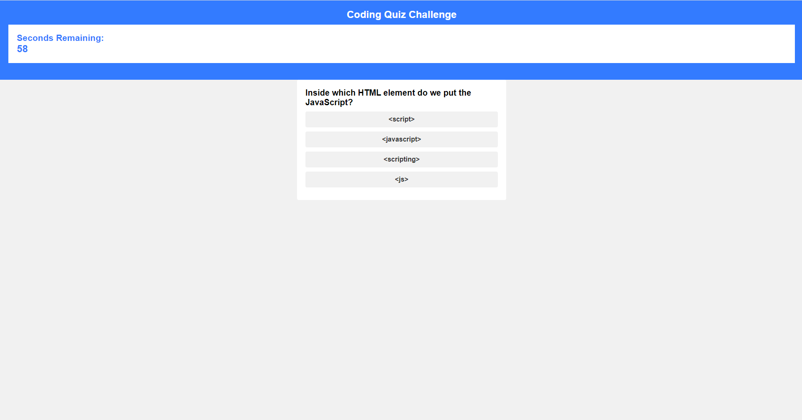
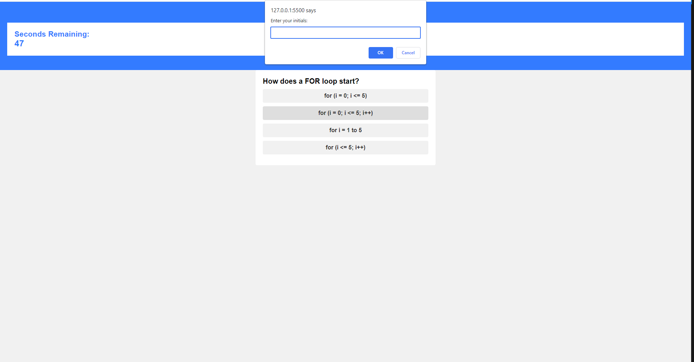
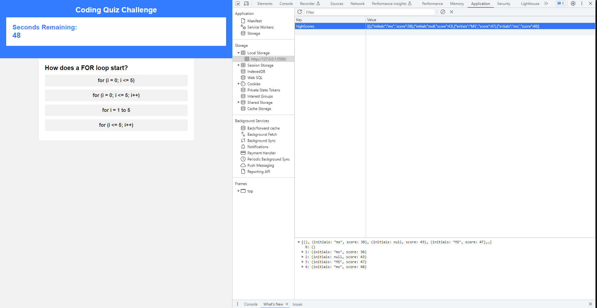

# Web Api Quiz (Module 4)

## Description

This application allows the user to answer a quiz. When an answers is provided, another question is displayed. If the user provides an incorrect answer, 10 seconds are deducted from the timer. When the quiz is finished, the user can store is socre - the time remaining - in the local storage, by writing their Initials.

URL: https://mdslva.github.io/WebApiQuiz/

## Credits

Completion of the project was done with the help of Tutors
